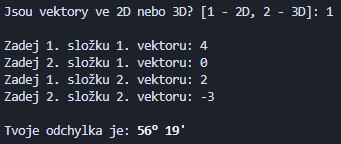

# Vektorová Kalkulačka
Tato kalkulačka vám umožní jednoduše spočítat základní operace s vektory, které se používají v analytické geometrii.
### Zatím kalkulačka umožňuje spočítat:
- Délku vektoru
- Skalární součin
- Vektorový součin
- Odchylku vektorů

Další operace budou postupně přidány.
### Ukázka kalkulačky:
